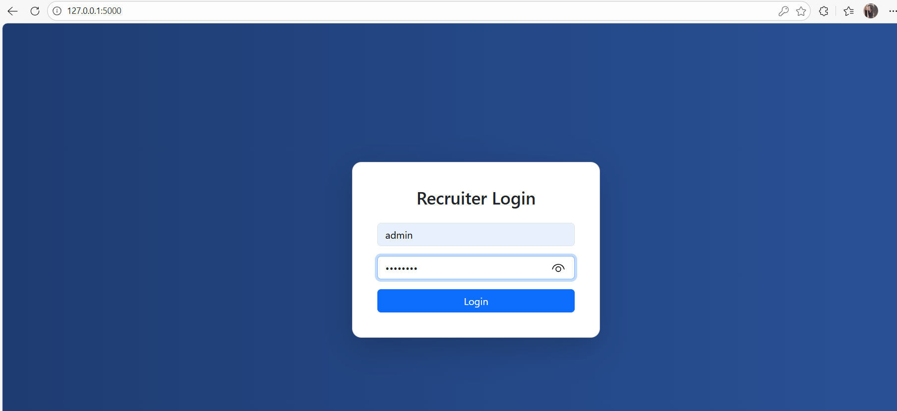
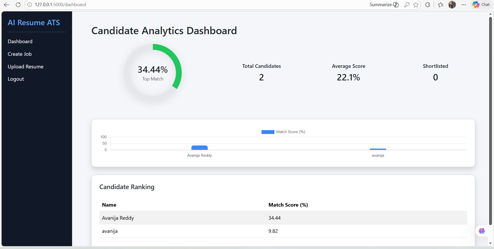
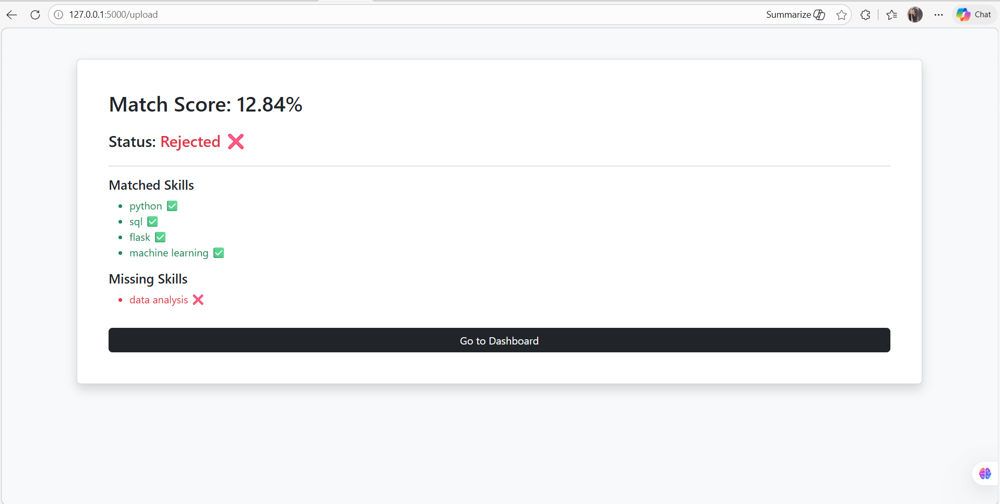

# AI Resume Screening System (ATS)

An AI-based Resume Screening System that automatically analyzes resumes and matches them with job descriptions using NLP techniques.

## Features

- Recruiter login system
- Create job roles with required skills
- Upload candidate resumes (PDF)
- AI-based skill matching
- Match score calculation
- Candidate analytics dashboard
- Candidate ranking system

## Technologies Used

- Python
- Flask
- NLP (TF-IDF + Cosine Similarity)
- MySQL
- HTML / CSS / JavaScript
- Chart.js

## Project Screenshots

### Login Page

### Upload Resume

### Job Creation

### Dashboard

### Resume Match Result

## How to Run

1. Clone the repository
git clone https://github.com/Avanija22/AI-Resume-Screening-System.git

2 Install dependencies

pip install -r requirements.txt

3 Run the application

python app.py

4 Open in browser

http://127.0.0.1:5000

## Future Improvements

- Deep learning resume analysis
- Skill recommendation
- Resume ranking system
- Cloud deployment
